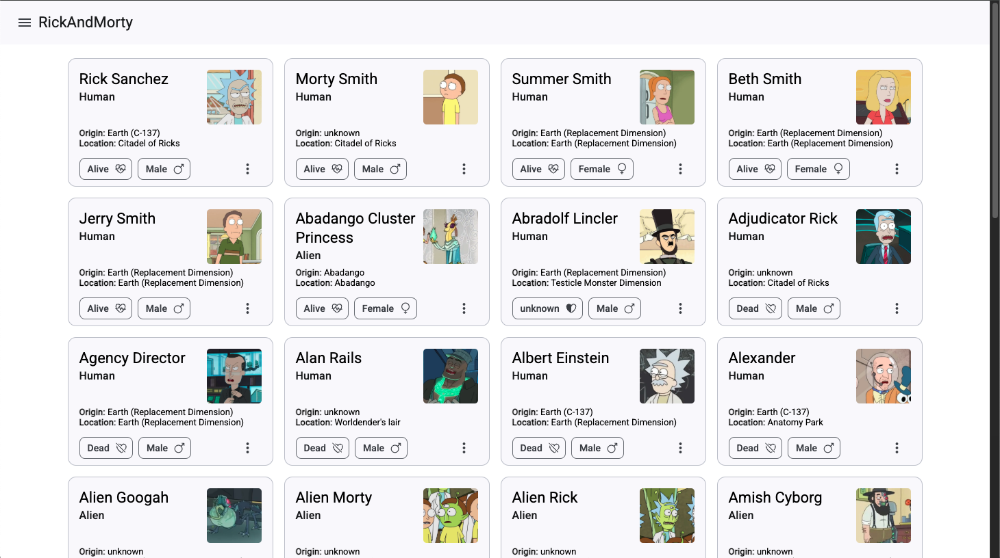
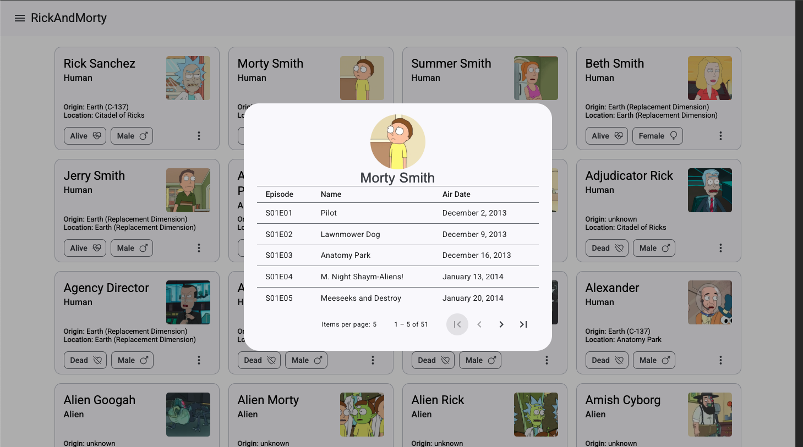

# Proyecto Rick and Morty

## Descripción

Este es un proyecto basado en la serie Rick and Morty, donde se utiliza la Rick and Morty API para mostrar información sobre los personajes. Los datos se cargan dinámicamente a medida que el usuario hace scroll.

## Características

- Listado de personajes con carga dinámica al hacer scroll.

- Manejo de estado con NgRx.

- Interfaz de usuario con Angular Material.

- Consumo de la Rick and Morty API para obtener información actualizad

## Capturas de pantalla

